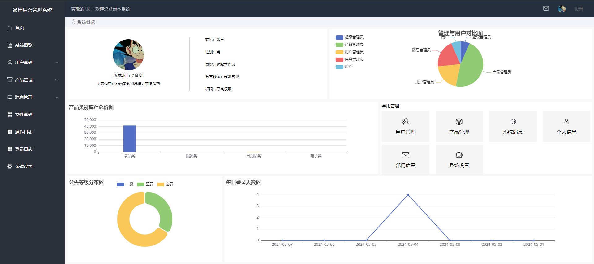
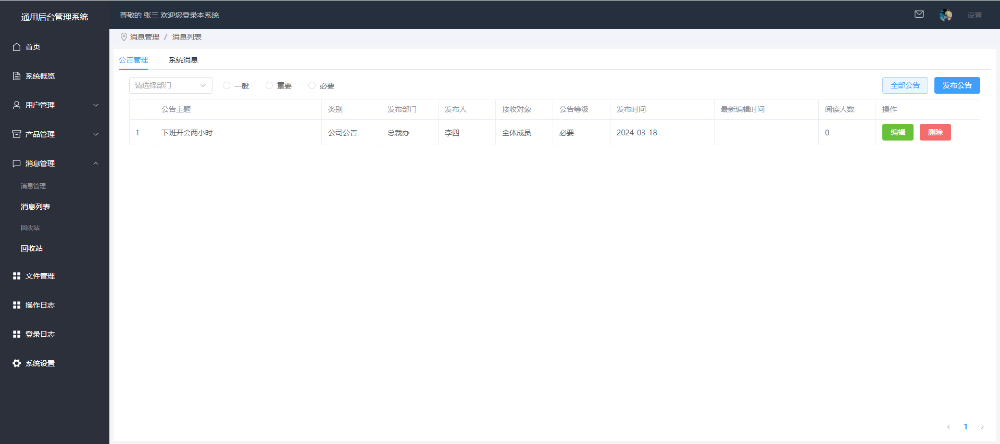

<<<<<<< HEAD
安装依赖
pnpm install

启动
pnpm run dev
### 服务端接口地址在back分支

## 一、项目概要

node版本

```
18.18.0
```


依赖下载

```
pnpm install
```

启动

```
pnpm run dev
```

## 二、界面预览

### 1、登录页面


忘记密码-弹窗1


忘记密码-弹窗2


二、首页


三、系统概览



### 四、用户管理

产品管理


用户管理


消息管理员


用户列表


### 五、产品管理

入库列表-产品列表


入库列表-审核列表


出库列表


### 六、消息管理

消息列表-公告管理



消息列表-系统消息


回收站


### 七、文件管理


### 八、操作日志


### 九、登录日志


### 十、系统设置


>>>>>>> efb9c63 (修复bug和编写readme文件)

